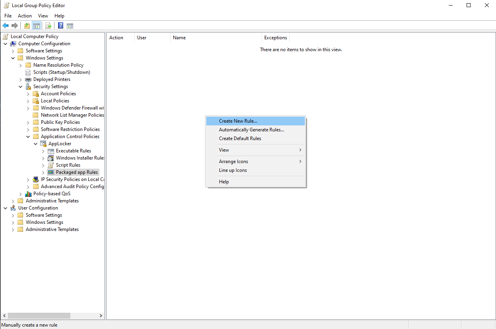
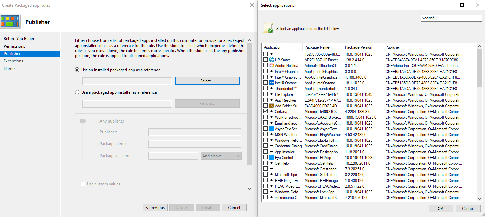
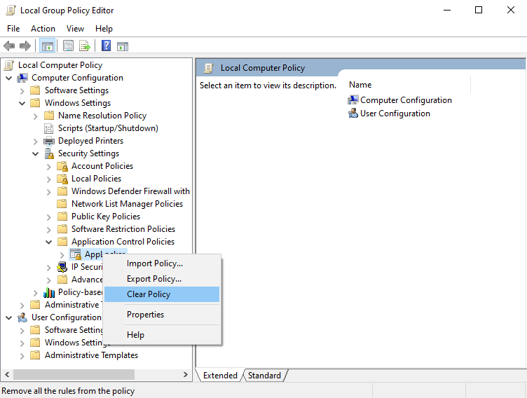
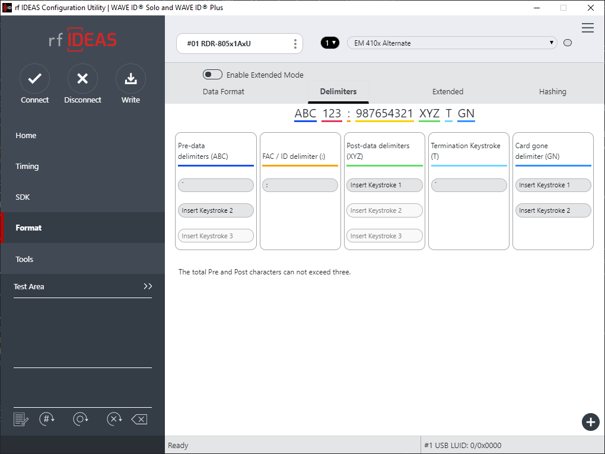

# Innergy Kiosk Setup Process

## Background

[Multi-app assigned access Windows kiosk](https://learn.microsoft.com/en-us/windows/configuration/lock-down-windows-10-to-specific-apps) terminal setup instructions for [Innergy](https://www.innergy.com/) shop computer kiosk terminals.

[Innergy](https://www.innergy.com/) is a browser based ERP system designed for the cabinetry and millworking industry. Time tracking, material tracking and other features require internet access and shop kiosks spread around a faility are a good way to enable employee access and encourage system usage. RFID login is a standard login option to help streamline kiosk usage and eliminate logon errors. While single app kiosk mode would greatly simplify kiosk creation the private browsing session clearing funcionality breaks the Innergy logon process. Innergy's logon accepts a username and passcode which requires typing in an email address during every logon request. To simplify this process numerical keyboard input preceded by a ``` ` ``` is recognized as RFID input by the logon screen javascript and processes the employee logon. Because the private browsing session has no previously stored session information available, the logon page is common across Innergy customers and a numerical string can be used by multiple employees across various companies the terminal requires a configuration which allows for semi-persistent storage of session information. To take advantage of the standard policies applied by kiosk mode and allow for company information to persist, multi-app assigned access was chosen to provide a standardized appliance-like device for shop and common area usage.

This setup and configuration process creates a locked down kiosk terminal that logs itself in, automatically runs Chrome, locks Chrome to Innergy URLs, force installs the [Innfinergy plugin](https://chrome.google.com/webstore/detail/innfinergy-v420/ajdehnbmilfnjbfhffbjdmkohamimpjo), works with RFID readers for login, is compatible with QR code scanning, allows for printing, disables the Windows 11 upgrade if installed on Windows 10, and survives OS patching with minimum maintenance while keeping a restricted user profile.

## System Requirements

- Windows 10 Pro, Pro for Workstations or Enterprise for use on kiosk
  - Version 22H2 recommended
  - Multi-app kiosk on Windows 11 is not officially supported as of December 2022 - test support is in build 25169
- *Optional* RFID reader
- Computer running Windows 7+, Server 2008R2+ for provisioning package creation

## Preparation on Another Machine

Build / edit [XML](innergy-provisions.xml) configuration for [multi-app kiosk](https://learn.microsoft.com/en-us/windows/configuration/lock-down-windows-10-to-specific-apps) provisioning package creation. The sample below was developed for this guide.

### Sample XML File - Replace GUID Instances as Necessary
``` AppUp.IntelGraphicsExperience_1.100.3408.0_x64__8j3eq9eme6ctt ``` may differ or be omitted depending on hardware specifications.
```
<?xml version="1.0" encoding="utf-8" ?>
<AssignedAccessConfiguration 
    xmlns="http://schemas.microsoft.com/AssignedAccess/2017/config"
    xmlns:rs5="http://schemas.microsoft.com/AssignedAccess/201810/config"
    >
    <Profiles>
        <Profile Id="{8252CB4A-CAE0-4AA1-A402-AB242FF45943}">
            <AllAppsList>
                <AllowedApps>
                    <App AppUserModelId="Windows.PrintDialog_cw5n1h2txyewy" />
                    <App AppUserModelId="windows.immersivecontrolpanel_cw5n1h2txyewy!microsoft.windows.immersivecontrolpanel" />
                    <App AppUserModelId="AppUp.IntelGraphicsExperience_1.100.3408.0_x64__8j3eq9eme6ctt" />
                    <App DesktopAppPath="%PROGRAMFILES%\Google\Chrome\Application\chrome.exe" rs5:AutoLaunch="true" />
                </AllowedApps>
            </AllAppsList>
            <rs5:FileExplorerNamespaceRestrictions>
                <rs5:AllowedNamespace Name="Downloads"/>
            </rs5:FileExplorerNamespaceRestrictions>
            <StartLayout>
                <![CDATA[<LayoutModificationTemplate xmlns:defaultlayout="http://schemas.microsoft.com/Start/2014/FullDefaultLayout" xmlns:start="http://schemas.microsoft.com/Start/2014/StartLayout" Version="1" xmlns="http://schemas.microsoft.com/Start/2014/LayoutModification">
                      <LayoutOptions StartTileGroupCellWidth="6" />
                      <DefaultLayoutOverride>
                        <StartLayoutCollection>
                          <defaultlayout:StartLayout GroupCellWidth="6">
                            <start:Group Name="">
                            <start:DesktopApplicationTile Size="2x2" Column="0" Row="0" DesktopApplicationLinkPath="%ALLUSERSPROFILE%\Microsoft\Windows\Start Menu\Programs\Google Chrome.lnk" />
                            </start:Group>
                          </defaultlayout:StartLayout>
                        </StartLayoutCollection>
                      </DefaultLayoutOverride>
                    </LayoutModificationTemplate>
                ]]>
            </StartLayout>
            <Taskbar ShowTaskbar="true"/>
        </Profile>
    </Profiles>
    <Configs>
        <Config>
            <Account>innergy</Account>
            <DefaultProfile Id="{8252CB4A-CAE0-4AA1-A402-AB242FF45943}"/>
        </Config>
    </Configs>
</AssignedAccessConfiguration>
```

Package the XML configuration with [Windows Configuration Designer](https://learn.microsoft.com/en-us/windows/configuration/provisioning-packages/provisioning-create-package) and copy the .ppkg output to flash drive for later installation on the kiosk machine.

#### Windows Configuration Designer Package Settings
```
Advanced Provisioning
All Windows desktop editions
Runtime settings > MiltiAppAssignedSettings > Select XML file
```

Copy the registry entries for pseudo [MDM appearance](https://hitco.at/blog/apply-edge-policies-for-non-domain-joined-devices/) to the flash drive for registry updates on the kiosk machine. These edits will cause Chrome to think the kiosk machine is managed by Active Directory or another MDM provider and allow for setting the otherwise restricted group policies for startup URLs.

## Kiosk Setup

An existing Windows installation may work, however for the purpose of this guide a clean install is expected. If imaging will be utilized, this guide can be thought of as a good starting point for a template.

### Lockdown BIOS

It is recommended to set the password for BIOS administration to prevent the password being set by another party in the future.

### Windows Installation

Install Windows. Upon initital boot do not connect the kiosk to the internet, this will allow the install process to create a local user account without a password or security questions. The password will be set later during the setup process. To create the initial user, select "Skip for now" at the "Let's connect you to a network" screen, click the "Offline Account" and "Limited Experience" links in the lower left corner of the screen. It is recommended to use a common username across kiosks for this account to simplify manual administration tasks.

### Initial Configuration

After initial login activate Windows, install all updates, patches, drivers, etc. and complete standard computer setup tasks.

Download and install [Chrome](https://www.google.com/chrome/) from the administrative account.

Add the ``` innergy ``` kiosk user without a password using computer management or with PowerShell:
```
PS C:\> New-LocalUser -Name "innergy" -FullName "Innergy" -NoPassword -PasswordNeverExpires -UserMayNotChangePassword
```

```-PasswordNeverExpires``` may cause the command to fail, if so remove the switch and set the option after user creation through Computer Management

Add the ``` innergy ``` kiosk user to the ``` Users ``` group:
```
PS C:\> Add-LocalGroupMember -Group "Users" -Member "innergy"
```

Logon to the innergy user account and set the desired screen resolution.

Add registry entries for [pseudo MDM appearance](https://hitco.at/blog/apply-edge-policies-for-non-domain-joined-devices/) by editing the registry to match or running the [MDM registry file](MDM-FakeEnrollment-Win10.reg) as the administrative user.

Add the provisioning package to the kiosk using PowerShell:
```
Add-ProvisioningPackage -PackagePath "D:\innergy.ppkg"
```
If updating the package from a previous install add -ForceInstall to overwrite
```
Add-ProvisioningPackage -PackagePath "D:\innergy.ppkg" -ForceInstall
```

### Applocker Fixes for Preinstalled Apps

Whitelist Cortana to avoid a full screen error message that applocker has prevented it from running and logging an error about AppLocker blocking backgroundTaskHost.exe

Open the local group policy editor (gpedit.msc) and expand
``` Computer Configuration > Windows Settings > Security Settings > Application Control Policies > AppLocker > Packaged app Rules ```

Right click and "Create New Rule" and click next through the defaults to the "Publisher" section. Click the "Select" button under "Use an installed packaged app as a reference" and select Cortana from the list, then click "Create" to generate the rule.





If another process generates errors on logon add it to the whitelist using the same process or prevent it from running on start.

### Alternative AppLocker Setup

**AppLocker removal does not seem to be required on Windows 10 build 22H2 - the kiosk provisioning did not create AppLocker rules while testing, would recommend verifying no rules are in place on first installation during configuration.**

AppLocker can be painful to manage in this environment and may not be required on a browser kiosk with restricted Chrome policies applied in a physcially controlled production environment. This is especially true if the machine resides on a separated guest network without access to internal resources and can be rebuilt quickly if problems arise. The tradeoff between best practices security configuration and ease of use and management led us to simply disable AppLocker for our kiosk setup and significantly reduced the time spent dealing with user blocking popup screens.

``` Computer Configuration > Windows Settings > Security Settings > Application Control Policies ```

Right click "AppLocker", select "Clear Policy" and answer yes to the prompt. This will clear all existing AppLocker rules including the automatically generated rules created by the kiosk setup process and prevent AppLocker from blocking any apps and background processes.



### Download and install [Chrome GPOs](https://support.google.com/chrome/a/answer/187202) on kiosk computer.

Please see the reference file for recommended [group policy settings](GPO.md).

Set a Windows version through group policy to prevent an unexpected Windows 11 upgrade. See [Computer Configuration > Administrative Templates > Windows Components > Windows Update > Windows Updates for Business](GPO.md)

### Set Administrative Password

Set a password for the initial user created during install if not already done. This login can be used for all administrative and maintenance tasks.

### Enable Autologon

Update the registry to [enable autologon](https://learn.microsoft.com/en-us/troubleshoot/windows-server/user-profiles-and-logon/turn-on-automatic-logon) for the ``` innergy ``` user or use the [registry file](AutoLogon.reg).

## Testing and Completion

Reboot the computer and let innergy logon and open Chrome to the [Innergy kiosk page](https://app.innergy.com/kiosk/). Chrome may display an error page the first time it runs on autologon if policy settings were not applied before executing. Reboot once more to apply policies. If the screen locks from timeout, simply login as ``` Innergy ``` by selecting the ``` innergy ``` user (no password required). Chrome is the only available application and is restricted to Innergy domains. The assigned access profile also locks the ``` innergy ``` user to only showing start menu icons defined in the XML, allows for logout and shutdown/reboot and disables changing most other options. All other system operations must be completed from the administrative account or another user that does not have the provisioning profile assigned to the account.

## RFID Reader Integration

The rf IDEAS WAVE ID SP Plus (RDR-80MH1AKU-LF) was used to provide a wide range of compatiblity (specifically Paxton Net2 using the EM410x Alternate profile) and easy configuration with standard modifiable keystroke output. Integration with an existing installation and product familiarity defined the hardware requirements, otherwise alternative RFID readers may be used.

Innergy uses a leading ``` ` ``` to define RFID input. To logon to the kiosk page with a security token the card's output number is set using the administration interface and will automatically login an employee that scans the matching card. The Net2 cards output an 8 digit numerical string when activated, output length for other cards may vary. Configuration will vary per reader/manufacturer, but involves adding leading and trailing ``` ` ``` marks to the generated output string.

### Wave SP Plus Configuration

Open the [rf Ideas Configuration Utility](https://www.rfideas.com/support/tools/downloads) on a workstation used to configure hardware, plug in the reader and connect to the device.

Open the ``` Format > Delimeters  ``` section and add a ``` ` ``` to the ``` Pre-data delimeters ``` and ``` Termination keystroke ``` fields. The trailing ``` ` ``` is required to fire the event and log the user in after triggering the RFID input listener with the leading ``` ` ```.

Write the changes to the device and plug it into the kiosk terminal to begin using RFID badges to logon.

The reader can be tested by focusing input on any text field (notepad is a good program to use) and swiping the card to display the output.



### Workstation Reader

An additional reader is installed on an office computer for new employee / replacement card setups. Standard output will simply type the card identification string (omitting the ``` ` ```) when scanned and makes it easy to generate RFID codes in the Innergy adminstration page. From the computer with the card reader installed, open the ``` Human Resources > Employees ``` tab within Innergy, select the employee, click ``` SCAN RFID ``` from the employee's page, scan the card on the workstation reader to input the code and save.
